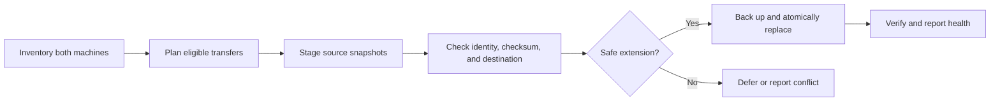

# Agent Sync

**Continue an AI coding conversation on another computer without losing either copy.**

I built this to work across a MacBook and a Linux workstation. Coding assistants
keep conversations, project memories, and sidebar records in local stores; copying
those files naively can overwrite new edits or move a conversation without making
it visible in the other app.

Built by **Jackie Oliver**, September 2026.

**Stack:** Python standard library · SSH/rsync · systemd · JSONL · SHA-256

## What it does

- Transfers Codex and Claude Code conversations between two machines.
- Synchronizes Claude Code project memories and desktop sidebar records.
- Defers active conversations, detects conflicting histories, and backs up replacements.
- Runs on a five-minute Linux timer, with no model calls in the sync path.

## Why the synchronization logic works this way

| Decision | Reasoning and implementation |
| --- | --- |
| Compare content before replacing a conversation. | A newer modification time does not establish which history contains the other. Codex updates require byte-prefix compatibility. Claude can also compare ordered conversation records while ignoring machine-specific housekeeping records. Divergent conversation content is left for review. |
| Recheck at the destination. | A transfer plan can become stale while bytes are moving. The endpoint checks the expected destination digest, active-file state, and source checksum; it checks again before replacement. |
| Stage, back up, then commit a file change. | Transfer and publication are separate. Replacements use a temporary file and atomic rename; new files use an atomic create that refuses to replace a file that appeared meanwhile. This reduces partial-write and overwrite risks. |
| Defer live files. | Open conversations and files changed within two minutes wait for another run. The endpoint also checks the Codex writer guard. |
| Record a fixed historical cutoff. | Pre-existing Linux conversations must remain excluded from upload to the Mac even if they are resumed later. A frozen identity baseline implements that policy. |
| Give memories a different merge policy. | Project memories are mutable documents, not append-only conversations. They use a settle window, newer-file selection, and same-second conflict reporting; `MEMORY.md` indexes merge entries by link target. |
| Treat offline machines differently from failures. | A sleeping laptop is normal. Access failures, storage exhaustion, conflicts, and missing verified reports need attention; routine offline periods do not. |

These are implemented safeguards, not a claim of zero possible data loss. The
protocol operates over changing application-owned files and does not provide a
transaction spanning both computers. Source deletions are not propagated;
temporary staging data and older backups are cleaned up separately.

## Read the implementation

| File | What to look for |
| --- | --- |
| [sync_sessions.py](sync_sessions.py) | Identity matching, historical exclusions, planning, staging, and transfer orchestration. |
| [session_endpoint.py](session_endpoint.py) | Path confinement, checksum checks, conversation comparison, conflict handling, backup, and atomic publication. |
| [memory_sync.py](memory_sync.py) | Project pairing and document/index merge policy. |
| [app_sessions_sync.py](app_sessions_sync.py) | Sidebar-record synchronization and cross-machine path mapping. |
| [check_sync_health.py](check_sync_health.py) | Verified-report checks, incident state, and recovery hysteresis. |
| [scheduled_sync.py](scheduled_sync.py) | Timer entrypoint, reachability, and deduplicated desktop alerts. |

## Development history

The repository retains the original implementation and follow-up fixes:

- [Initial synchronization system](https://github.com/jackieoliver/agent-sync/commit/e57771d).
- [Staging cleanup, prechecks, and Ethernet fallback](https://github.com/jackieoliver/agent-sync/commit/eee921f).
- [Conversation-record comparison](https://github.com/jackieoliver/agent-sync/commit/10b5460): two machines can have the same conversation but different app bookkeeping.
- [Conflict monitoring correction](https://github.com/jackieoliver/agent-sync/commit/267d708): a standing conflict should not make a completed run look stale.

## Setup and operating boundaries

This is an operational tool for a configured pair of machines, not an install-and-run
service. It needs SSH access, host-key verification, machine paths, the frozen
historical baselines, and the endpoint scripts on both hosts. Follow the
[operations runbook](docs/OPERATIONS.md) before running it.

From a configured checkout, `python3 sync_sessions.py` previews a transfer plan
without applying conversation replacements. It still contacts the other machine.
`--apply` performs eligible transfers. Do not use an unrestricted third-party sync
command in place of this helper: it does not implement this project's cutoff.

## Evidence and limitations

The operations record documents the initial migration of **824 Codex history
files and 890 Claude files**, with destination checksums checked at the time.
Those are historical deployment results, not a benchmark rerun for this README.

The public repository does not currently contain a standalone automated regression
suite. The runbook records earlier regression checks, but they are not reproducible
from a committed test harness here. Application storage formats can change, and
cross-machine behavior requires configured hosts to validate.

The core sync uses no model tokens. Optional email escalation is a separately
configured Claude scheduled task; it is not an email service provided by this repo.
